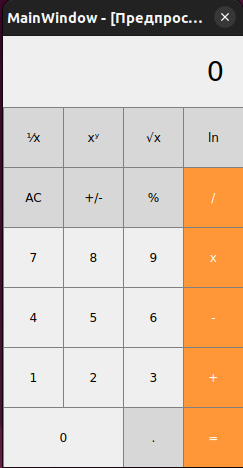

## engineering_calculator
Небольшой инженерный калькулятор, написанный на С++ с использованием фреймворка Qt. 
Основные возможности: 
  - работа с целыми и вещественными числами (12 знаков); 
  - сложение, вычитание, умножение, деление; 
  - изменение знака числа; 
  - вычисление процента от введёного числа; 
  - вычисление 1/х, где х - введёное число; 
  - возведение введёного числа х в степень введённого числа у; 
  - извлечение квадратного корня из х, где х - введёное число; 
  - вычисление натурального логарифма введённого числа. 

